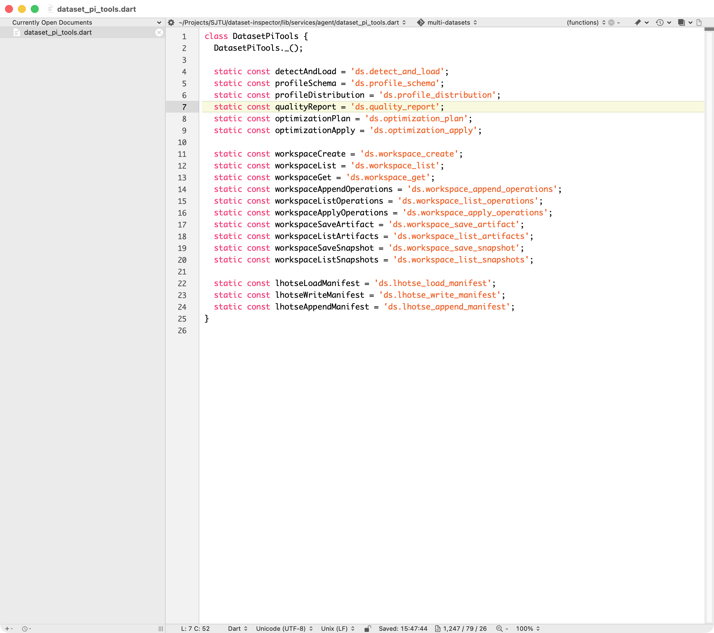

# BBEdit Extras



A collection of add-ons for [BBEdit](https://www.barebones.com/products/bbedit/), the professional text editor for macOS.

- **Monokai Light** — a light color scheme with crisp, Monokai-inspired syntax contrast on a clean white background.
- **Dart Language Module** — codeless language module providing syntax highlighting, comment parsing, and function folding for `.dart` files.

<br clear="all">

## Installation

One-line install,

```sh
curl -fsSL https://raw.githubusercontent.com/binbinsh/bbedit-monokai-light/main/install.sh | sh
```

This installs both files to the correct BBEdit support directories:

| File | Destination |
|------|-------------|
| `Monokai Light.bbColorScheme` | `~/Library/Application Support/BBEdit/Color Schemes/` |
| `Dart.plist` | `~/Library/Application Support/BBEdit/Language Modules/` |

Restart BBEdit after installation to load the language module.

## Usage

Open **BBEdit → Settings → Text Colors** and select **Monokai Light** from the color scheme list.

## Dart Language Module

| Feature | Details |
|---------|---------|
| File types | `.dart` |
| Keywords | Dart language keywords and built-in core types |
| Highlights | Annotations, comments, strings, numeric literals |
| Extras | Nested `/* ... */` comment parsing, function scanning & folding |

## Dart LSP

With the Dart language module installed, you can enable LSP support for full code intelligence:

1. Install the Dart SDK (`brew install dart-sdk`, or use the one bundled with Flutter).
2. Open **BBEdit → Settings → Languages**, find **Dart**, and switch to the **Server** tab.
3. Set **Command** to `/opt/homebrew/bin/dart`.
4. Set **Arguments** to `language-server --protocol=lsp`.

Once configured, you get autocompletion, diagnostics, and go-to-definition for `.dart` files.

## Updating & Uninstalling

- **Update:** Re-run the install command — files are overwritten in place.
- **Delete color scheme:** `rm ~/Library/Application Support/BBEdit/Color Schemes/Monokai Light.bbColorScheme`
- **Delete Dart module:** `rm ~/Library/Application Support/BBEdit/Language Modules/Dart.plist`

## License

[Apache License 2.0](LICENSE)
